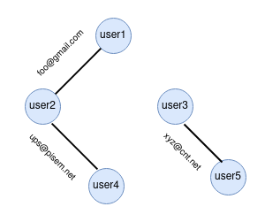

## Emails    
[](https://travis-ci.org/amasterenko/job4j_mail)
[](https://codecov.io/gh/amasterenko/job4j_mail)  

### Задача  
Имеется n пользователей, каждому из них соответствует список email-ов (всего m email-ов).
Считается, что если у двух пользователей есть общий email, значит это
один и тот же пользователь.  
Требуется построить и реализовать алгоритм, выполняющий слияние пользователей.
На выходе должен быть список пользователей с их email-ами (такой же, как на
входе).  
В качестве имени объединенного пользователя можно брать любое из
исходных имен. Список email-ов пользователя должен содержать только
уникальные email-ы.  

__Пример входных данных:__     
```
user1,xxx@ya.ru,foo@gmail.com,bar@mail.ru  
user2,foo@gmail.com,ups@pisem.net  
user3,xyz@cnt.net,vas@uniq.com  
user4,ups@pisem.net,aaa@wap.com  
user5,xyz@cnt.net  
```

__Выходные данные:__   
```
user1,xxx@ya.ru,foo@gmail.com,bar@mail.ru,ups@pisem.net,aaa@wap.com  
user3,xyz@cnt.net,vas@uniq.com  
```

###  Описание алгоритма  
Для нахождения объединенных пользователей использован граф, вершинами которого являются пользователи.
Ребром графа выступает email, общий для 2-х пользователей (вершин).
В этом случае задача сводится к построению "списка смежности"
(["adjacency list"](https://en.wikipedia.org/wiki/Adjacency_list)), обходу графа с помощью поиска
"в ширину" (["bread-first"](https://en.wikipedia.org/wiki/Breadth-first_search)) для нахождения 
"компонент связанности" (["component"](https://en.wikipedia.org/wiki/Component_(graph_theory))) и объединения списков email-ов в этих компонентах.  

Список смежности и граф для примера выше:  

| Вершина      | Связанные вершины   |  
|--------------|---------------------|  
| user1        | user2      |   
| user2        | user1, user4 |   
| user3        | user5      |  
| user4        | user2      |  
| user5        | user3      |  

  

Для хранения вершин графа создан внутренний класс [User](src/main/java/ru/job4j/Handler.java). 
Его поле _linkedUsers_ содержит ряд из смежных пользователей (вершин). 
Поле _isMerged_ - вспомогательное и используется при обходе графа "в ширину".  

### Установка и запуск приложения  
1. Скопировать проект.  
2. Установить Maven.  
3. Перейти в каталог проекта, содержащий файл _pom.xml_ и выполнить команду ```mvn clean install```.    
4. Выполнить java -jar target/job4j_mail.jar filename, где filename - путь к текстовому файлу с входными данными.  
Формат строк файла:```user,email1,...,emailM```  

5. В папке проекта появится файл с результатами работы _result.txt_.  
